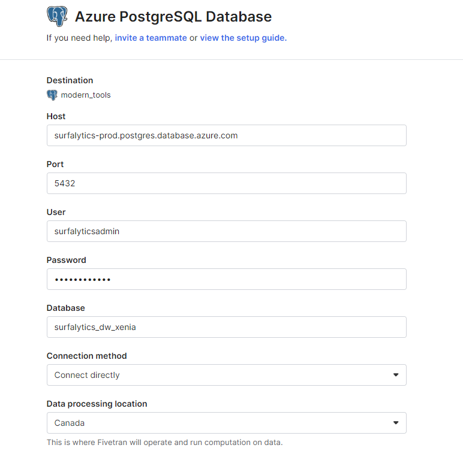
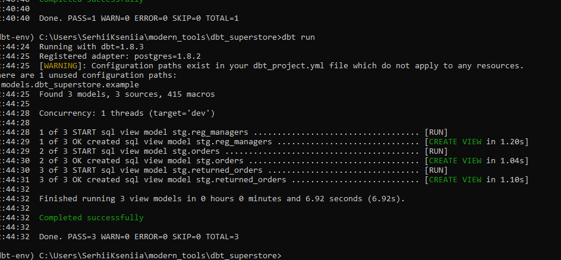
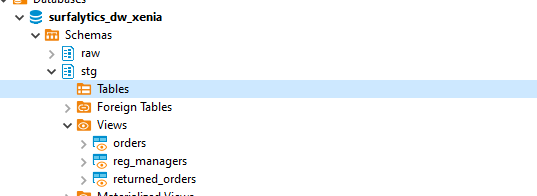

# Setting up Azure PostgreSQL Database with DBeaver

## Connecting to Azure PostgreSQL Database

1. **Open DBeaver:**
   - Launch the DBeaver application on your computer.

2. **Create a New Connection:**
   - Click on the "New Database Connection" button in the toolbar at the top left side, or click on the "Database" menu and select "New Database Connection".

3. **Select PostgreSQL:**
   - In the "Connect to a database" dialog, choose "PostgreSQL" from the list of available databases and click "Next".

4. **Configure Connection Details:**
   - **General Tab:**
     - **Name**: Azure PostgreSQL
   - **Connection Tab:**
     - **Host**: surfalytics-prod.postgres.database.azure.com
     - **Port**: 5432 (or 6432 if using PgBouncer)
     - **Database**: postgres
     - **Username**: surfalyticsadmin
     - **Password**: Data2024!
   - **SSL Tab:**
     - Check "Use SSL" for secure connections.

5. **Test Connection and Save:**
   - Click "Test Connection" to ensure connectivity.
   - Click "Finish" to save the connection.

# Creating Database and Schema, Ingesting Tables

1. **Create a New Database:**
   - Execute `CREATE DATABASE SURFALYTICS_DW_XENIA;` in the SQL Editor.

2. **Create Schema:**
   - Execute `CREATE SCHEMA STG;` in the SQL Editor.

## ETL process
ETL process is handled by Fivetran. 
Create Fivetran account, and set destination and connectors.The process involves extracting data from source (in our case the data is in Excel), transforming it into the desired format, and loading it into the PostgreSQL database on Azure. 

   - Create account in Fivetran
   - In cdestinations, select Azure Postgre SQL and make connection with dbase:
   
   - In connectors, select google drive and folder with files that need to be uploaded, paste it in schema "raw"


## Setup dbt Core and create new dbt project 
1. Create a new virtual environment  
python3 -m venv venvs/dbt_env       # create the environment

2. source venvs/dbt_env/bin/activate     # activate the environment for Mac and Linux OR
venvs/dbt_env\Scripts\activate            # activate the environment for Windows

3. python3 -m pip install dbt-postgres    #install  dbt core and dbt database adapter to connect to Postgres

4. dbt init dbt_superstore              # run dbt project


## Define and specify source tables in sources.yml
  
  # Create sources.yml file in models folder and specify source tables metadata as in example below
    sources:
   - name: dbt_superstore
      description: Data from Superstore dataset
      database: SURFALYTICS_DW_XENIA
      schema: stg
      tables:
         - name: orders
         description: Raw orders data
         - name: people
         description: Raw data for regional managers
         - name: returns
         description: Raw data for returned orders


  # Create `stg_orders` view in stage dbt model1\bronze
   ```sql
   {{ config(
  materialized='view',
  alias='orders'
) }}

SELECT
    row_id AS dwh_id,
    order_id,
    order_date,
    ship_date,
    ship_mode,
    customer_id,
    customer_name,
    segment,
    country,
    city,
    state,
    case when city = 'Burlington' and postal_code is null then '05401' else postal_code end as postal_code,
    region,
    product_id,
    category,
    sub_category,
    product_name,
    sales,
    quantity,
    discount,
    profit,
    current_timestamp AS etl_timestamp
FROM {{ source('superstore', 'orders')}}

# Create `stg_managers` view in stage dbt model1\bronze
  {{ config(
  materialized='view',
  alias='reg_managers'
) }}

SELECT
    regional_manager AS manager_name,
    region,
    row_number() OVER () AS dwh_id,
    current_timestamp AS etl_timestamp
FROM {{ source('superstore', 'people') }}

## Create `stg_returned_orders` view in stage dbt model1\bronze
  {{ config(
  materialized='view',
  alias='reg_managers'
) }}

SELECT
    regional_manager AS manager_name,
    region,
    row_number() OVER () AS dwh_id,
    current_timestamp AS etl_timestamp
FROM {{ source('superstore', 'people') }}

## Run and deploy the models to the datawarehourse in dev:
dbt debug # check the connection
dbt compile # to compile the models
dbt run #to run the models



You should be able to see the views in your datawarehouse in stg schema (dev environment):



